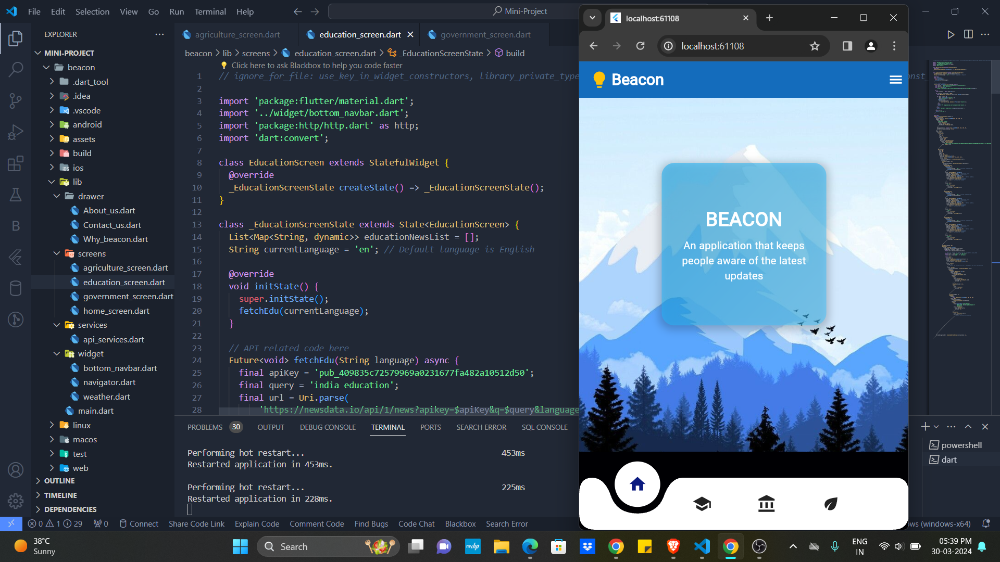

---

# Beacon

Beacon is a Flutter mobile application designed to empower users with real-time information tailored to their needs and interests. Whether you're seeking the latest news updates, educational resources, government policies, or agricultural insights, Beacon has you covered. Stay informed, stay empowered with Beacon.



## Features

- **Real-time Updates**: Get the latest information and updates in real-time across various categories such as news, education, government policies, and agriculture.
- **Personalized Content**: Tailored content delivery based on user preferences for a personalized and efficient experience.
- **User-Friendly Interface**: Intuitive and easy-to-use design for seamless navigation and accessibility.
- **Weather Information**: Stay updated with current weather conditions, including temperature, humidity, wind speed, and more.

## Screenshots

## Main 3- Screens

**Education_screen**

**Government_screen**

**Agriculture_screen**


## Architecture

Beacon follows a modular architecture to ensure scalability, maintainability, and ease of development. The application is divided into various modules, each responsible for a specific feature or functionality. The key architectural components include:

- **Drawer**: Contains navigation drawers for different sections of the application, including About Us, Contact Us, and Why Beacon.
- **Screens**: Individual screens for each section of the application, such as About Us, Contact Us, Why Beacon, and Weather.
- **Widgets**: Reusable UI components used across different screens, such as bottom navigation bar, info cards, and weather widget.

## Technologies Used

Beacon is built using the following technologies:

- **Flutter**: Google's UI toolkit for building natively compiled applications for mobile, web, and desktop from a single codebase.
- **Dart**: The programming language used to write Flutter applications.
- **Google Fonts**: A collection of open-source fonts provided by Google, used for custom typography in the application.
- **Weather Icons**: A set of weather-themed icons used to represent different weather conditions in the weather widget.

## Getting Started

To get started with Beacon, follow these steps:

1. **Clone the Repository**: Clone this GitHub repository to your local machine using the following command:
   ```bash
   git clone https://github.com/your_username/beacon.git
   ```

2. **Install Dependencies**: Navigate to the project directory and install the necessary dependencies using Flutter's package manager, pub:
   ```bash
   cd beacon
   flutter pub get
   ```

3. **Run the Application**: Run the Beacon application on your preferred device or simulator using Flutter's command-line tools:
   ```bash
   flutter run
   ```

## Contributing

Contributions to Beacon are welcomed and encouraged! Here's how you can contribute:

1. **Fork the Repository**: Fork this repository to your GitHub account.
2. **Create a Branch**: Create a new branch for your feature or bug fix.
3. **Make Changes**: Make your desired changes to the codebase.
4. **Test Changes**: Test your changes thoroughly to ensure they work as expected.
5. **Submit a Pull Request**: Once satisfied, submit a pull request detailing your changes.

## License

This project is licensed under the [MIT License](LICENSE).

---

